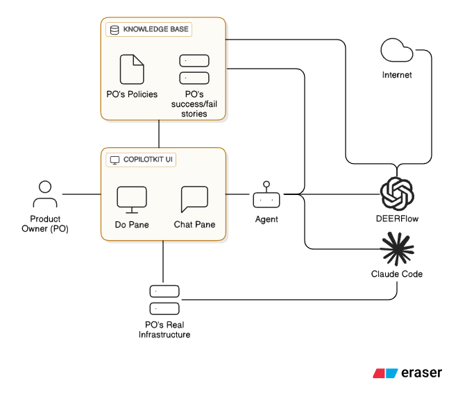
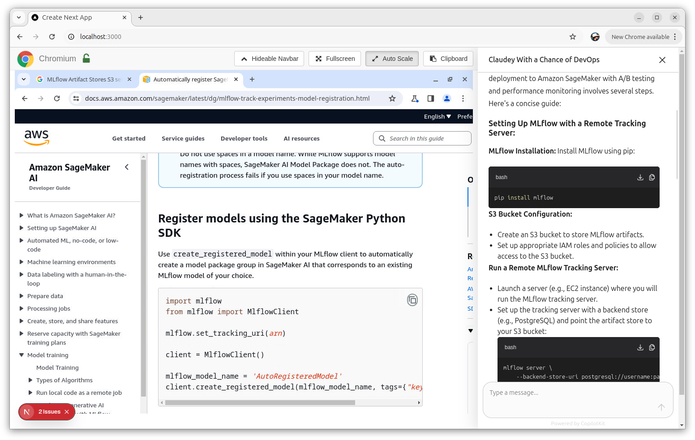

# Claudey With a Chance of DevOps

Claudey With a Chance of DevOps ("CWCD") is a DevOps assistant powered by Claude Code. Say what you want. Claude Code will build and deploy it.

## Architecture Overview

## Screenshot

## Is CWCD "Vibes DevOps"?

Yes, Claudey With a Chance of DevOps is vibes DevOps.

*But*, CWCD believes that DevOps is a more serious domain with more serious decisions and consequences, so the tooling should reflect that. So, "vibes" does not necessarily mean "fun and low-stakes" but more like DevOps as a real-time system: say what you want, and get back *something*! Maybe correct? Maybe useful? But definitely expensive and turned in before you finish your tea.

CWCD enforces best practices. It will decline to perform actions which contradict best practices. Of course, you can set your own best practices, which CWCD will then enforce.

## Architecture: Policy-Driven DevOps

CWCD implements a **policy-driven DevOps** model where organizational standards and best practices are enforced, not suggested.

### Core Components

**Apache Answer as Policy Engine**: Apache Answer serves as the single source of truth for organizational DevOps policies. It contains:
- Tech stack requirements (cloud platform, IaC tools, programming languages)
- Operational standards (backup/restore, disaster recovery, monitoring)
- Compliance requirements and patterns
- Organizational decision history and rationale

**Policy-First Enforcement**: CWCD always simultaneously obeys both the PO user and *all* relevant policy from AA. If the two ever conflict, CWCD explains the conflict and stops. The PO must then either change the request or change the policy.

### Knowledge Evolution

Apache Answer captures decisions, rationale, and outcomes as the system operates, building institutional DevOps memory. Organizations can:
- Update policies directly in Apache Answer
- Refine policies through conversational alignment with Claude
- Share/fork policy datasets across teams or organizations
- Build community-driven "DevOps constitutions" for different contexts (startup, enterprise, regulated industries)

### Influences

- Key phases: Explore, Plan, Build, Confirm
- Can real-time systems teach us about running, coordinating, succeeding with agents? E.g. voting for 2/3 consensus?
- Can Erlang/OTP supervision trees teach us about agents.
  - Actor model, immutable message passing
  - Stateless, Crash-only design, restart mentality
  - Fail fast
- Trees
  - Document Tree
  - CouchDB reduce: can confirmation/correctness/validation be bottom-up reduction up a tree?
  - Plan tree - root node is human request, unpacks to details, to build, to validate, to report back
    - HTN plan?
    - GOAP?

# Whiteboard

The Plan to Launch my Product

- **Develop**
  - **Must have dev/staging/prod terraform**
    - **Choose a platform provider**
  - Core product **following the requirements**
  - **Code review**
    - Double-check Confirm correct tech stack
    - ?
- **Deploy**
  - Push to dev
  - ?
- **Confirmation**
  - **Correct operation of the app**
    - **Simulate all major personas**
    - ?
  - **Confirm all NFRs**
  - **Fetch 
- Final Report - tell the human nothing but that which has been confirmed

## Controlling Claude Code

- CLAUDE.md, possibly one per subdirectory
  - Reference other files, possibly with "@"[?], e.g. CHANGELOG.md, PLAN.md
- Populate .claude/.../settings.json, maybe on the fly
- Sub agents
  - Could be dynamically generated, JIT, Matrix
- Sweet spot right now is command-line tools (e.g. `gh`) more effective than MCP
- LLM window is 200,000 tokens
- TDD may be non-negotiable
- Can tell it to scan Git history
- ADRs and PRDs referenced from CLAUDE.md
- 5h session window?
- CC + Playwright MCP works great e.g. running product & take SS so CC can check correctness
- Parallelizing CC
  - Work trees
  - Subtasks (sub-agents)
- Check for API or hook access:
  - Use the "Escape" functionality via API?
  - Change the model like `/model`?
  - Compaction as a start of a new conversation
  - IDE stuff, e.g. referencing files (line numbers?)
  - dangerously skip? Is there a whitelist that could accomplish the same?
  - Context forking
  - Plan mode
  - All / commands, e.g. /review, /pre-commit
- Hooks
- Clear the context per conversation
- "think hard" instruction (also "think harder", "think hardest") pays dividends
- Prompting
  - Specify both the *what* and the *how*, e.g. Make a XYZ app with React Tailwind. Make compoents re-usable. Use c-r-a. Ensure npm run build works
- Must review code

Possible MCP "must haves"
- context7
- firecrawl

Planning process

1. Phase 1: Interactive mode - Q&A where the user answers every question, ascertains scope, current status, constraints, budget, etc.
1. Phase 2: Independent High-level prep
  - Complete enough of the plan to finish the high-level solution architecture and cost estimate
  - Proposal sent to human:
    - **Business Impact** - what does it accomplish, how it suits requirements and why that satisfies the goals
    - **High-level solution architecture** (e.g. platforms/serviced used, tech stack)
    - **Estimated recurring cost**
1. Phase 3: Independent mode - Continue building the tree top-down.
   - Possibly augment "hard-coded" milestones (e.g. "QA", "UAT", "Budget")
   - Have to expand/unpack all the nodes until you reach a level of detail sufficient to drive CC

Interactive mode questions:
- Broad operational context (business circumstances, user personas)
- Scope
  - Immediate short-term to ship today
  - Longer term vision to set direction
- Constraints (e.g. data homing, prefer specific infrastructure vendor)
- Budget

## Alternative Project Names

- CTFaux
- Free Startup CTO

## Decomposition

- https://github.com/search?q=llm%20task%20decomposition&type=repositories
- https://github.com/marawan1805/LLM-Task-Decomposition
- https://apxml.com/courses/agentic-llm-memory-architectures/chapter-4-complex-planning-tool-integration/task-decomposition-strategies
- https://github.com/arash-shahmansoori/hierarchical_planning_decompose_net
- https://github.com/soharabhossain/delegent
- https://apxml.com/courses/agentic-llm-memory-architectures/chapter-4-complex-planning-tool-integration/task-decomposition-strategies

## TODO

1. Confirm whether CC can deliver
1. Look into The Open Hands SecurityAnalyzer, its security layer
1. Identify any mcp servers if any that either could are have been reported to help CC. (Memory? etc)
1. Go through all of [Claude Code hooks](https://docs.anthropic.com/en/docs/claude-code/hooks) and see where it should connect. (e.g. MCP)
1. Voice input
1. See if Apache Answer is right vs. a couple DB tables. If the way CC sees this information is a bunch of ADRs and PRDs committed, why bother with a big KB vs. a bag of JSON? The original theory was the community accumulates a global knowledge base about what works well *for CWCD*, because only a CMS/KB could scale to the huge scope of vibes devops (all objectives, all languages, all platforms, all security contexts, all risk appetites), while being Free and flexible and open sourcey.
1. Unknown whether RAGFlow adds value (e.g. as a MCP resource to DEERFlow to aggregate/integrate Apache Answers?)
1. See if Atomic Agents are worth the risk. In general figure out the Agent platform.
1. Think through the UX better. If CC is so awesome, why make a web UI instead of CLI? Why make something complex that glues together random other projects and probably requires Docker rather than a simple `npm install`? For now, the hypothesis is:
  - The Web UI and copilot UX reflects the higher stakes and more complex work involved in DevOps.
  - Gluing seems to have paid good dividends to RAGFlow. So that is an inspiration. Also to some extent, CC is "just" an npm package because they put in the hard work to make `claude` batteries-included (web search, file edit, etc.) whereas my priority is run the experiment and get fast feedback.

## Thoughts

- Eject
- Maybe seed a workbook or something to eject vibes.diy
- Undecided: Copy the claude model, i.e. boot up in a folder, help maintain that repo. Is that compatible with an invisible/transparent master repo that uses git submodules?
- Log all "architecturally significant" work, changes, accomplishments, etc. which affect the structure, non-functional characteristics, dependencies, interfaces, or construction techniques, to the Apache Answer KB. Or maybe a KB article has an **ADR** tag to indicate it's an ADR. 
- For now the user will be called the Product Owner (PO) to evoke that Agile role however actual users are more likely to be developers, etc.
- Docker - runs in a container? Can run containers? Can pull containers?
- [MetaGPT](https://github.com/FoundationAgents/MetaGPT) looks like it has lots of overlap and working code
- [Instructor](https://github.com/567-labs/instructor/tree/main) structured output for LLMs (overlap with Pydantic and others?)
- During "boot" step or initial step, use a Day-1 framework to build a score to guide everything. e.g. risk appetite, budget
- Build 3 keep 1
- Instead of managing a data model, use the filesystem and ask claude code to expand, maybe use ReST
- Maybe CWCD operates out of a main "minimal monorepo" with a CLAUDE.md and it uses git submodules to actually interface with e.g. a team's GH repos, docker repos, etc.
- Possibly Atomic Agents as the persona, depends how useful Atomic Agents are
- UI is [CopilotKit](https://github.com/CopilotKit/CopilotKit)
- Maybe after the DEERFlow research, it outputs into an AA story but not posted yet. Then work from that story, possibly make updates/edits. Then save it as a success/failure story to the KB.
- Perhaps with open source (agent?) building a "family tree of KBs" (e.g. "the AWS one", "the Azure one"), this creates knowldege "nucleation sites" or "well-traveled paths" where CWCD has lots of successes in an area and so more people feel comfortable using it for only that responsibility.
- Is it helpful to steal the Base + LoRA language or architecture regarding the family tree of KBs, where the base might be "use Linode" then the LoRA is another article about how to build a to do app on Linux, so the output is a to do app on Linode? I think the answer is no.
- CC <-> Browser Use bridge, or it could even connect into the :9222 CDP
- CC web UIs, e.g. [claude-code-webui](https://github.com/sugyan/claude-code-webui) or [Claude Code UI](https://github.com/siteboon/claudecodeui/blob/main/public/screenshots/desktop-main.png)
- CC directly inserting, executing JS in Do Pane browser
- Guardrails, maybe a monitor looking for data leaks, exfiltration, maybe an OTP supervisor
- Maybe T-shaped 3-panes so auth is in a window above or below it all rather than in thd chat?
- During boot or discover or init phase, either have a few basic archetypes ready (e.g. starving artist low-stakes anything-cheap vs. high-value work with mandatory DR and dev/prod/staging, etc.)
- Maybe an ingestion step like claude does, just read-only learning the ropes, the environment, the context
- Must have very clear Definition of Done
- Maybe part of using or forking is seeding/pruning the knowledge base with opinions and mandatory requirements. Default KB seed might be mandatory site policy:
  - Must have DR. All DR must be tested regularly. (IMO if agents will be involved in ops, the risk of a trusted user error is going up too.)
  - Must have backup and restore. All backups must be tested regularly.
  - Must use AWS/Azure/GCP/etc
  - Data processing? Data engineering? Databricks vs. cloud native
  - Dev/prod/staging
  - CICD
  - Bronze/Silver/gold data
  - Backend is language/stack A, front-end is language/stack B.
  - Must use IaC, e.g. terraform. Might be non-negotiable
  - Testing
  - Primary programming language, primary tech stack, etc.
- Maybe during "boot" ask the user if they want to discuss any tech opinions or use the defaults. If they discuss then it updates the KB accordingly, e.g. Docker shop, SoftLayer shop
- Need to decide if it's in scope to hook it into your GH, your Jira, Confluence, so it can learn everything. I think the answer is no for now. That is effectively either buiding a KB importer and/or building a KB out of existing GH, Jira, etc.
- Maybe use [Docker Headless VNC container](https://github.com/ConSol/docker-headless-vnc-container) which is made to run Chrome, Firefox. But maybe it loses the CDP control that comes out of the box with browser-use
- Unlike coding only where time can freeze, DevOps usually requires "human" oversight, i.e. checking logs or disk utilization, or testing backups. Everything CWCD builds will require some human and/or agent followup, e.g. check the billing numbers. Or IMO, "test the backups" is something you could/should never automate (i.e. Claude Code must test and validate a backup, not a cron job). Otherwise, you need to test the cron job, but circumstances change over time, so you need to revisit the test--it's the wrong. Either vibes devops requires a more regular interaction and check-in, or else DevOps is no longer a useful role to serve.
- I wonder if data engineering should be in scope? e.g. Terraform up some Databricks and then API into the Databricks and build out some storage and some pipelines and pull from your vendor and pump it through to dump it into a data warehouse. That seems doable? Is that cool or is that scope creep?
- KB answers tagged "Policy" must be obeyed completely and all "Policy" knowledge which applies must be obeyed. KB answers not tagged "Policy" are advisory with thumbs up counts indicating real-world endorsements and thumbs-down real-world failures.
- Maybe all the **Policy** documents appear to Claude Code as Git [ADRs](https://cognitect.com/blog/2011/11/15/documenting-architecture-decisions), perhaps with some summaries or overviews in documentation or CLAUDE.md.
- Maybe zen-mcp-server wrapped by Claude to help plan stuff, perhaps in [plan permissions mode](https://docs.anthropic.com/en/docs/claude-code/iam#permission-modes). Maybe it is a resource of DEERFlow, or of the agent. Perhaps unrelated to running claude to execute the commands, just using CC to call zen for research.
- Running Claude Code
  - Possibly an Atomic Agent or Autogen wrapper around it. CC is not a "member of the team" but rather part of the "brain" of the system
  - Maybe use the [MCP permissions system](https://docs.anthropic.com/en/docs/claude-code/cli-reference)
- I feel like at some point, controlling the repo behind Claude Code's back as it were, and probably controlling CC's state, will happen. Most likely example is updating the CLAUDE.md file. or edit the [claude settings](https://docs.anthropic.com/en/docs/claude-code/settings)
- The word "AI" is deliberately absent in this project. It's too vague. It's better to say: LLMs, transformers, APIs, SDKs, messages, records, whatever is clear and crisp. Also "vibes devops" is already enough cheek.

Claude Code SDK
- There is a CLI, TypeScript, and Python SDK. It seems there is parity but not confirmed.
- [Custom system prompts](https://docs.anthropic.com/en/docs/claude-code/sdk#custom-system-prompts)
- [Custom permission prompt](https://docs.anthropic.com/en/docs/claude-code/sdk#custom-permission-prompt-tool) to pipe back into CopilotKit
- Feels like session management will be big

Debugging
- Unclear if LangGraph's audit/rewind advantages fit in here. I think it requires embracing LangGraph as opposed to Atomic Agents which is on the table
- Maybe LightLLM LLM gateway running audits on everything

Experiment to use CC to help on policy:
1. Output all policy as Markdown into CLAUDE.md with article IDs
2. Tell Claude that CLAUDE.md is obsolete. It needs updating by exploring the real codebase
3. Force it to maintain the article IDs consistently, tombstone them, etc.
4. Use an LLM, Agent, whatever to structure that for the PO to approve then sync to the KB

Testing
- Maybe a suite of challenges + KBs and some "hand-written" tests to confirm, like query the GraphQL API, check for an email sent, etc.
- Some policies are easier to check, e.g. a blank AWS environment as a Terraform target

## Dogfood

- A public registry/KB that people's CWCD can use
- If it's hard to run (anything harder than npm install), maybe have a web site where you chat with a running demo of the tool, and you tell it you want to run CWCD but you are on Windows and it helps you run it in Google cloud or something
- Build out a cloud platform to run ComfyUI pipelines to help development. Specifically if I stream while I work on this project and yell at clouds about semicolons. Then overnight, ingest the streams, ingest the transcript, ingest the GitHub activity, etc. and output something useful like text (how to configure automatic semicolon removal in the IDE or CICD) if not a PR. Perhaps use Florence2
- Watch live YT feed and alert for audio or video issues
- Pet Peeves Project
- Build a scaling testing framework for [dnsd](https://github.com/iriscouch/dnsd)
- iOS?
- Ruby DSL to build prompts--very intuitive, concise, clear expression that evaluates to a string
- Easy "hello world" to run in major cloud. Then it can bootstrap, e.g. set up secrets vault, backups
- P2P platform to sell GPU time to each other
- Use Atomic Agents to build something inspired/cloned of OTP supervision tree
- A bot that clones an open source Git repo (e.g. GH, GL), generate CLAUDE.md and submit a PR. Perhaps random lottery
- Video games
  - e.g. find an engine, e.g. 2d platformer, Godot, web, iOS, NES
  - Web based NES Emulator, but you request in natural language and it implements it in the hardware or as Game Genie, etc.
  - AI NPC such as [FluidHTN](https://github.com/ptrefall/fluid-hierarchical-task-network) or something LLM or NVIDIA. E.g. an open source game but "patched" with Lua, etc. script:
    - Custom trash talk from the LLM.
    - To use AI to generate new random patterns for Bald Bull every time you play.

## Experiments

Side-goals of this project are to experiment in this new frontier:

### Should we build knowledge bases and CMSes explicitly/exclusively used by LLM agents?

To what extent is re-using existing infrastructure and networks (Email, chat, CMS, community platforms, web services) for LLMs and Agents helpful vs. wasteful? If it helps, is it "really" useful (the platform directly added value, the agents upvoted/downvoted and moderated and found consensus) or incidentally usful (i.e. it was just a cheap and fast way to implement queueing, message passing, search, etc.)

### The Sung Heroes: Can LLMs increase the value of human experts and developers by tracking and recognizing their contribution?

I would love to ship something good and then put my feet up and say, *"Sing me a song of my unsung heroes. Their struggles and their glory. And also their consulting fees. And their Patreon."*

The LLMs are copying our work output and our techniques and our analyses. The least they could do is spend a couple tokens writing down a name once in a while. Then, for the first time, I will see all the people who volunteered to help me. It will be thousands of names.

To solve this, could CWCD keep close track of all human inputs? Specifically:

1. Community posts to Stack Exchange, GitHub, Reddit, etc.
2. Direct open source software dependencies

Track it all. Keep it current as the project evolves. Have the information available if asked.

MVP is to be able to list a bunch of names, maybe split by community vs. software dependencies. Later, perhaps content for RAG and deep search: "Do any of my sung heroes live in my area?" "What Stack Exchange answers were critical to my success? Do any of those authors have an active Patreon?" "Please estimate the person-years of volunteer time it took to create my Free Software dependencies. How much would all that Free Software cost to build, at North American market rates?"

- For community posts, citation by DEERFlow should be easy; and subsequently written up into project documentation and/or the KB.
- For software dependencies, exporting or reporting dependencies and licenses is a pretty straightforward tech policy for the KB. But really we want humans, not packages: attribute every major author of every software package. Thus for the first time, we can ask "who are some of the people who helped make today possible?" and we will see thousands of names.

### Publish a framework in multiple languages e.g. TypeScript, Python

Maybe find a common 3rd language from other big tools
